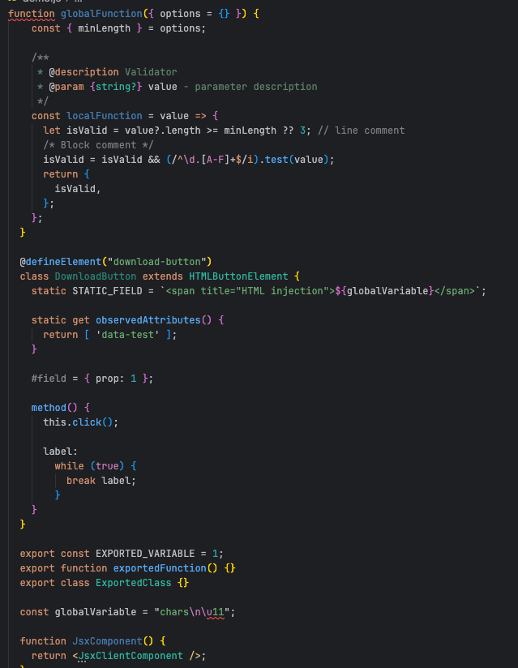
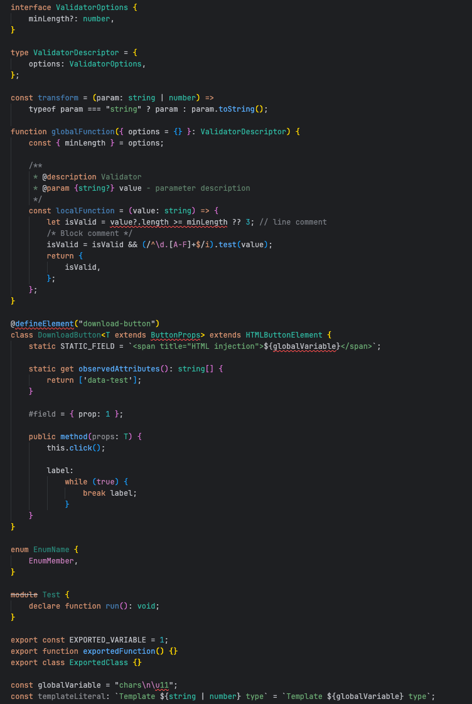

# JetBrains' Dark Theme - Customized

A VS Code color theme converted from a custom JetBrains IDE dark theme, aiming to provide a familiar experience for JetBrains users in VS Code.

## Examples

### Javascript

### Typescript

## Features

- Dark theme optimized for readability and reduced eye strain
- Color scheme based on JetBrains IDEs dark theme, with personal touches
- Carefully selected colors for syntax highlighting
- Consistent styling across different languages
- Special attention to TypeScript/TSX support

## Installation

1. Install the theme from the VS Code Marketplace
2. Go to `Code > Preferences > Color Theme`
3. Select `Dark Converted From JetBrains`

## Feedback

If you find any inconsistencies or have suggestions for improvements, please feel free to open an issue on the repository.

## License

This theme is available under the MIT License.
